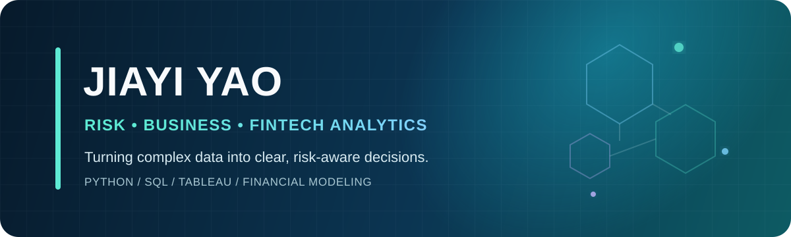

<p align="center">
  
</p>

<p align="center">
  <strong>M.S. Candidate in Applied Data Science @ The University of Chicago</strong><br/>
  Credit & Financial Risk · Business Analytics · FinTech
</p>

<p align="center">
  <a href="https://github.com/jiayi28yao/crypto-market-risk-analytics">
    
  </a>
  
</p>

## About me

I am an applied data science graduate student with formal training in **credit management** and hands-on experience across **commercial banking, bond financing, investment banking, and economic policy research**. I turn complex financial and operational data into measurable risk signals, defensible models, and decision-ready recommendations.

| Finance foundation | Analytical training | Business impact |
|---|---|---|
| Credit risk, debt financing, due diligence, and financial analysis | Machine learning, statistical modeling, time series, and data engineering | KPI design, industry research, scenario analysis, and executive communication |
| **FRM Part I passed** | Python, SQL, Tableau, and reproducible pipelines | Client presentations and decision briefs |

> My approach: define the business question → validate the data → build and challenge the model → communicate the decision.

## Analytics toolkit

<p>
  
  
  
  
  
  
  
  
</p>

| Risk & Finance | Analytics & Modeling | Data & Communication |
|---|---|---|
| Market and credit risk | EDA and feature engineering | ETL and data validation |
| Debt repayment and default analysis | Classification, OOT validation, AUC, KS, and PR-AUC | Star-schema data modeling |
| Financial statement and scenario analysis | Time-series and threshold optimization | Tableau dashboards and executive presentations |

## Selected experience

- **Bank of China, Shaanxi Branch — Personal Banking Intern:** supported compliance and cross-border financial-service research; led a five-person study on international-student client acquisition and was recognized as an Outstanding Trainee.
- **Hengtai Changcai Securities — Bond Financing Intern:** contributed to offering documents, financial due diligence, debt-repayment risk analysis, and exchange-review responses.
- **Beijing Academy of Social Sciences — Research Assistant:** structured 127 digital-economy policy samples, applied topic clustering, developed KPI frameworks, and translated findings into Tableau-backed decision briefs.
- **Shenwan Hongyuan Securities — Investment Banking Assistant:** used Wind data, peer analysis, financial modeling, and scenario testing to support industry research and enterprise-risk assessment.

## Featured project

### [Crypto Market Risk Analytics](https://github.com/jiayi28yao/crypto-market-risk-analytics)

An end-to-end analysis of BTC and BNB that combines a reproducible market-data pipeline with risk-focused Python analysis, MySQL dimensional modeling, and Tableau reporting.

```text
Binance.US API  →  Parquet  →  MySQL  →  Python EDA  →  Tableau
```

**What the project demonstrates**

- Built and validated a dataset of more than 105,000 30-minute OHLCV observations
- Defined consistent return, volatility, and daily-range measures for cross-asset comparison
- Designed a MySQL star schema and repeatable daily aggregation workflow
- Translated technical analysis into portfolio-ready risk insights and recommendations

<p align="center">
  <a href="https://github.com/jiayi28yao/crypto-market-risk-analytics">
    
  </a>
</p>

## Additional analytical work

### [Credit Default Risk Modeling · Device Financing](https://github.com/jiayi28yao/credit-default-risk-modeling)

- Built an interpretable logistic probability-of-default baseline using FICO, borrower age, and financing variables
- Used strict 2025 out-of-time validation with ROC-AUC, PR-AUC, KS, Brier score, and calibration diagnostics
- Compared linear and nonlinear alternatives and translated predicted risk into an illustrative approval-threshold strategy

[Explore the full credit-risk project →](https://github.com/jiayi28yao/credit-default-risk-modeling)

### SureAttend · Attendance Prediction *(In Progress)*

- Currently leading an attendance-prediction project using 1,861 behavioral records, expanded to 3,563 rows with SDV-based synthetic-data techniques
- Conducting EDA, feature engineering, and model evaluation while coordinating business requirements
- Translating interim findings into client updates and product and engagement recommendations

## Education & credentials

- **The University of Chicago** — M.S. Candidate, Applied Data Science · Expected Dec 2026
- **Xi'an International Studies University** — Credit Management · 90.8/100 · Ranked 2/31
- **Credentials:** FRM Part I · Securities Market Laws & Regulations · IELTS 7.0
- **Additional tools:** Wind, MATLAB, Stata, SPSS, and EViews

## What I am building toward

I am interested in roles where finance, data, and decision-making meet—especially **Risk Analytics, Business Analytics, Credit Strategy, and FinTech**. I bring the quantitative depth to test a model, the financial context to challenge its assumptions, and the communication skills to turn its output into action.

<p align="center">
  <sub>Analyze carefully • Validate assumptions • Communicate clearly</sub>
</p>
